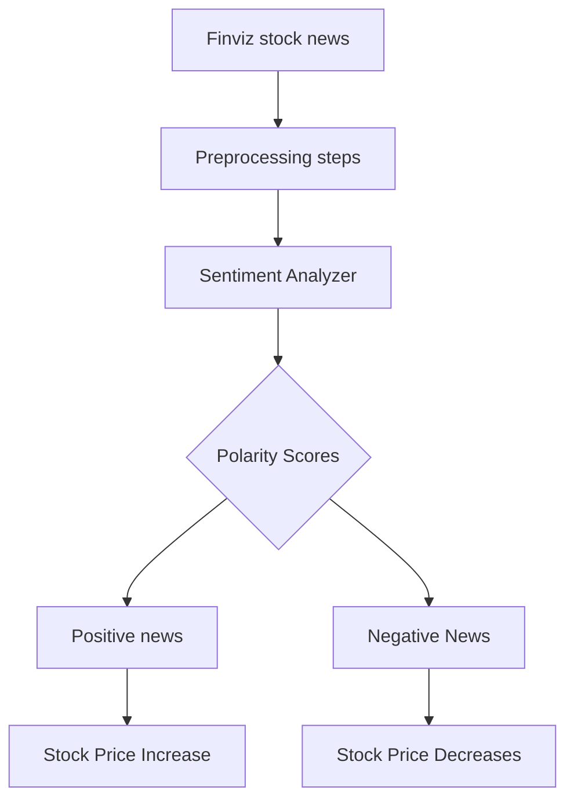

## Sentiment-Analysis-of-Stock-Market-Trading

## Introduction :

Sentiment analysis is a powerful technique used to determine the overall sentiment or opinion expressed in a piece of text. When applied to stock trading news, sentiment analysis can help investors and traders understand the market sentiment surrounding specific stocks or companies.

This project aims to perform sentiment analysis on stock trading news articles to gauge the sentiment associated with different private sector banks. By analyzing the sentiment, investors can gain insights into market perceptions and potentially make more informed trading decisions.

## Scrapping Headlines

There are Various ways to obtain news

* Finviz is the most powerful financial news website. By srapping this website, we can gather a large number of articles for sentiment anaysis.

  

   

## Steps :

1. Extract The Stock Tickers from URL
2. Extract the stock news headlines
3. Applying Sentiment Analyzer to calcuate polarity Scores
4. postive news
5. negitive news

## Flow chart :

## Bank Nifty Weightage 

